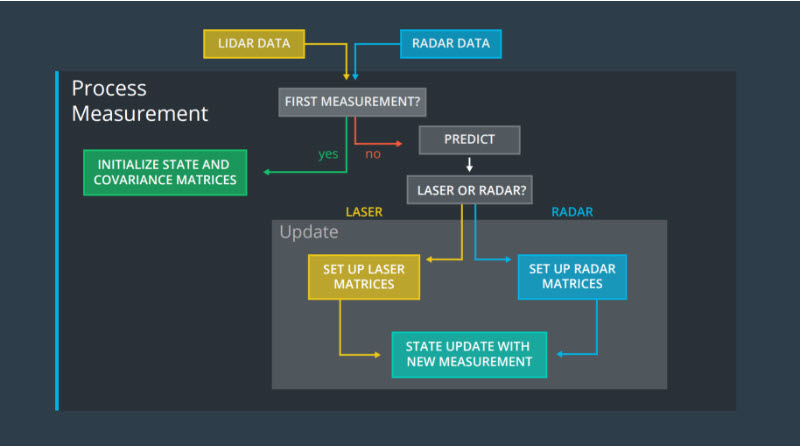
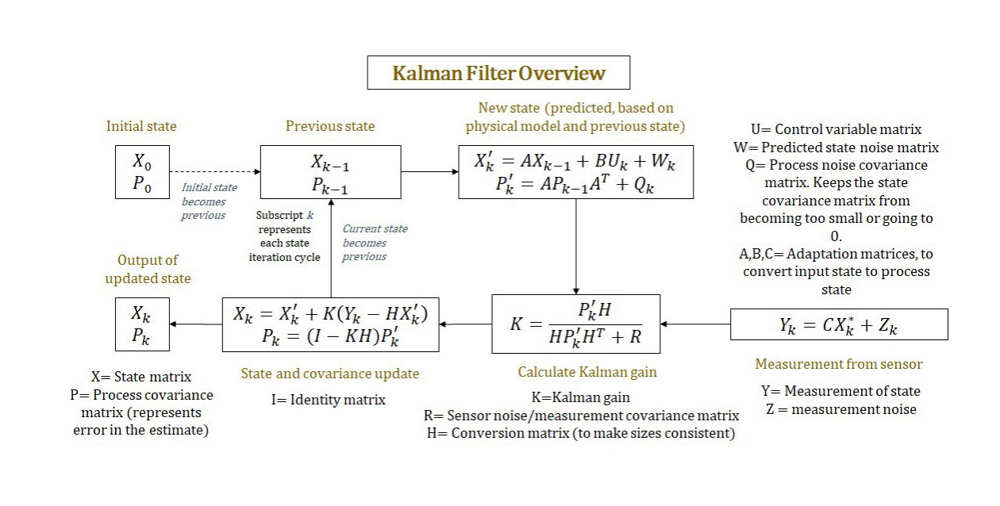

# Extended Kalman Filter Project

#### 1. What is a Kalman Filter
A Kalman filter is an optimal estimation algorithm used to estimate states of a system from indirect and uncertain measurements. A Kalman filter is only defined for linear systems. If you have a nonlinear system and want to estimate system states, you need to use a nonlinear state estimator.

Kalman filter is extensively used in estimating the car position using Lidar and Radar sensors. Measurement of these sensors are not accurate as they are subject to drift or noisy. Kalman filter can be used to fuse the measurement of these sensors to find the optimal estimation of the exact position.

### 2. Background/Motivation behind Kalman Filters
The Kalman filter was invented by Rudolf Emil Kálmán to solve this sort of problem in a mathematically optimal way. Its first use was on the Apollo missions to the moon, and since then it has been used in an enormous variety of domains. There are Kalman filters in aircraft, on submarines, and on cruise missiles. Wall street uses them to track the market. They are used in robots, in IoT (Internet of Things) sensors, and in laboratory instruments. Chemical plants use them to control and monitor reactions. They are used to perform medical imaging and to remove noise from cardiac signals.

### 2. How to Build This Project
This project involves the Term 2 Simulator which can be downloaded [here](https://github.com/udacity/self-driving-car-sim/releases)

This repository includes two files that can be used to set up and install [uWebSocketIO](https://github.com/uWebSockets/uWebSockets) for either Linux or Mac systems. For windows you can use either Docker, VMware, or even [Windows 10 Bash on Ubuntu](https://www.howtogeek.com/249966/how-to-install-and-use-the-linux-bash-shell-on-windows-10/) to install uWebSocketIO. Please see [this concept in the classroom](https://classroom.udacity.com/nanodegrees/nd013/parts/40f38239-66b6-46ec-ae68-03afd8a601c8/modules/0949fca6-b379-42af-a919-ee50aa304e6a/lessons/f758c44c-5e40-4e01-93b5-1a82aa4e044f/concepts/16cf4a78-4fc7-49e1-8621-3450ca938b77) for the required version and installation scripts.

Once the install for uWebSocketIO is complete, the main program can be built and run by doing the following from the project top directory.

1. mkdir build
2. cd build
3. cmake ..
4. make
5. ./ExtendedKF

Tips for setting up your environment can be found [here](https://classroom.udacity.com/nanodegrees/nd013/parts/40f38239-66b6-46ec-ae68-03afd8a601c8/modules/0949fca6-b379-42af-a919-ee50aa304e6a/lessons/f758c44c-5e40-4e01-93b5-1a82aa4e044f/concepts/23d376c7-0195-4276-bdf0-e02f1f3c665d)

### 3.  How does Kalman Filter Algorithm Works ?
Imagine you are in a car equipped with sensors on the outside. The car sensors can detect objects moving around: for example, the sensors might detect a pedestrian,or even a bicycle. Now we need to gather this sensor data and do calculations to find oout the location of the pedestrian or bicycle.

- **first measurement** - the filter will receive initial measurements of the bicycle's position relative to the car. These measurements will come from a radar or lidar sensor. 
- ***initialize state and covariance matrices*** - the filter will initialize the bicycle's position based on the first measurement.
- then the car will receive another sensor measurement after a time period ?t.
- ***predict*** - the algorithm will predict where the bicycle will be after time ?t. One basic way to predict the bicycle location after ?t is to assume the bicycle's velocity is constant; thus the bicycle will have moved velocity * ?t. In the extended Kalman filter Algorithm we will assume the velocity is constant.
- ***update*** - the filter compares the "predicted" location with what the sensor measurement says. The predicted location and the measured location are combined to give an updated location. The Kalman filter will put more weight on either the predicted location or the measured location depending on the uncertainty of each value.
then the car will receive another sensor measurement after a time period ?t. The algorithm then does another ***predict*** and ***update*** step.

Where X' is the newly predicted state produced by previous state X with F as  transition matrix and adding matrix U which considers acceleration.
We are keeping the acceleration noise components set to 9 in this project,  but U accounts for acceleration when this is not true. We also need to estimate the uncertainty in our estimation. This can be expressed by the state covariance matrix:

Where Q is the process noise covariance matrix, which is used to keep the state covariance matrix from becoming too small or going to zero.

Kalman Gain(KG): This fraction decides where to put weightage, in other words The Kalman gain tells you how much I want to change my estimate by given a measurement.

#### EKF (Extended Kalman Filter)

In this project we have use EKF, where we track the position and velocity of an object using the laser and radar range sensors, while laser
sensors represent measurements in catersian co-ordinate, the radar sensors represent in polar coprdinate. A direct converstion of polar corodinate to
cartesian corodinate gvies nonlinearity and so Kalman filter is not very useful. In order deal with non linear behavior we use method called first order
Taylor expansion to obtain linear approximation of polar coordinate measurements in the update.

Taylor Series (http://mathworld.wolfram.com/TaylorSeries.html)

We use Jacobian matrix which represents the linear mapping from polar to cartesian coordinate, applied at the update step. Hence the conversion matrix
H becomes the Jacobian matrix (Hj).

#### References
I am highly indebted to my previous Udacity students who created excellent articles in Udacity which made my life lot easier.
- https://medium.com/intro-to-artificial-intelligence/extended-kalman-filter-simplified-udacitys-self-driving-car-nanodegree-46d952fce7a3
- https://medium.com/@tjosh.owoyemi/kalman-filter-predict-measure-update-repeat-20a5e618be66
- https://medium.com/@mithi/object-tracking-and-fusing-sensor-measurements-using-the-extended-kalman-filter-algorithm-part-1-f2158ef1e4f0
- https://medium.com/udacity/udacity-self-driving-car-nanodegree-project-6-extended-kalman-filter-c3eac16c283d
-https://en.wikipedia.org/wiki/Taylor_series
- Mathworld.

